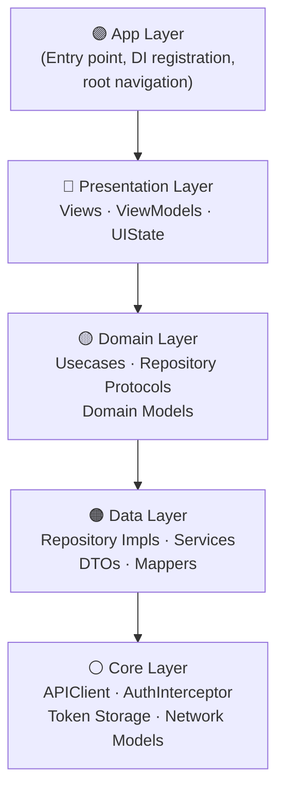
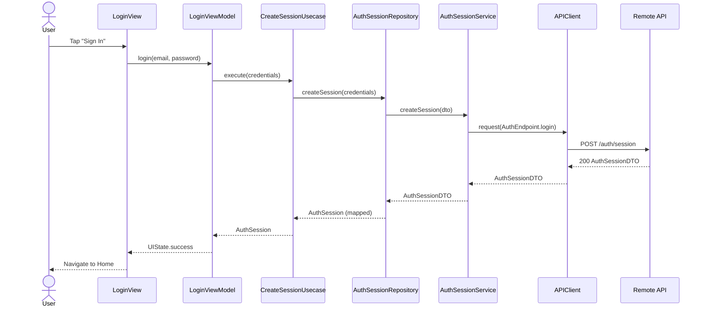

# SwiftStarter


A production-ready iOS starter template built with **Clean Architecture + MVVM**, designed to give
every new project a solid, scalable foundation from day one.

---

## Table of Contents

- [Overview](#overview)
- [Getting Started](#getting-started)
- [Architecture](#architecture)
- [Folder Structure](#folder-structure)
- [Data Flow](#data-flow)
- [Cross-Cutting Concerns](#cross-cutting-concerns)
- [Dependencies](#dependencies)
- [Contributing](#contributing)
- [License](#license)

---

## Overview

SwiftStarter is an open-source iOS project template that enforces strict layer separation,
protocol-first design, and dependency injection from the ground up. It is intended to be cloned
and extended — not built on top of — so architectural decisions are made once and shared across
every project that uses it.

**Core principles:**

- **Clean Architecture** — `Domain` is independent of frameworks, UI, and data sources.
- **MVVM** — Views are dumb; all state and business logic lives in ViewModels.
- **Protocol-first** — Every boundary is defined by a protocol, making units trivially testable.
- **Constructor injection** — All dependencies flow inward via `Factory`, never grabbed via singletons.

---

## Getting Started

```bash
git clone https://github.com/ReidoBoss/SwiftStarter.git
```

1. Open `SwiftStarter.xcodeproj` in Xcode.
2. Resolve Swift Package dependencies (`File → Packages → Resolve Package Versions`).
3. Select a simulator or device and press **Run** (`⌘R`).

> **Requirements:** Xcode 16+, iOS 17+, Swift 6.

---

## Architecture

SwiftStarter is organised into **5 strictly ordered layers**. Dependencies only point inward —
outer layers know about inner layers, never the reverse.



| Layer | Responsibility |
|---|---|
| **App** | `@main` entry, `Factory` container registrations, root `NavigationStack` setup |
| **Presentation** | SwiftUI Views, `@Observable` ViewModels, UI state enums |
| **Domain** | Pure Swift Usecases, Repository protocols, Domain-level models |
| **Data** | Concrete Repository implementations, Service protocols & impls, DTO↔Model mappers |
| **Core** | `APIClient` (Alamofire wrapper), `AuthInterceptor`, Keychain token storage, shared network types |

---

## Folder Structure

```
SwiftStarter/
├── App/
│   ├── SwiftStarterApp.swift          # @main entry point
│   ├── AppView.swift                  # Root view / navigation host
│   └── DI/
│       ├── Container+Auth.swift       # Factory registrations — Auth graph
│       └── Container+….swift          # Additional feature graphs
│
├── Presentation/
│   └── Auth/
│       ├── Login/
│       │   ├── LoginView.swift
│       │   └── LoginViewModel.swift
│       └── Register/
│           ├── RegisterView.swift
│           └── RegisterViewModel.swift
│
├── Domain/
│   ├── Usecases/
│   │   ├── CreateSessionUsecase.swift # Protocol + default impl
│   │   └── ….swift
│   ├── Repositories/
│   │   └── AuthSessionRepository.swift  # Protocol only
│   └── Models/
│       └── AuthSession.swift           # Pure domain model
│
├── Data/
│   ├── Repositories/
│   │   └── AuthSessionRepositoryImpl.swift
│   ├── Services/
│   │   ├── AuthSessionService.swift       # Protocol
│   │   └── AuthSessionServiceImpl.swift   # Alamofire calls
│   ├── DTOs/
│   │   └── AuthSessionDTO.swift
│   └── Mappers/
│       └── AuthSessionMapper.swift
│
└── Core/
    ├── Network/
    │   ├── APIClient.swift             # Generic Alamofire request executor
    │   ├── AuthInterceptor.swift       # 401 silent-refresh interceptor
    │   ├── Endpoint.swift              # Request builder protocol
    │   └── NetworkError.swift
    └── Storage/
        ├── AuthTokenStorage.swift      # Protocol
        └── AuthTokenStorageImpl.swift  # Valet (Keychain) implementation
```

---

## Data Flow

The sequence below shows a **login request** travelling through every layer and returning a result
back to the UI.



---

## Cross-Cutting Concerns

### Dependency Injection — `Factory`

All dependencies are registered in `App/DI/Container+*.swift` extension files. Each feature owns
its own registration file, keeping the container modular.

```swift
// Container+Auth.swift
extension Container {
    var createSessionUsecase: Factory<CreateSessionUsecase> {
        self { CreateSessionUsecaseImpl(repository: self.authSessionRepository()) }
    }
}
```

ViewModels resolve dependencies via `@Injected`:

```swift
@Observable final class LoginViewModel {
    @ObservationIgnored @Injected(\.createSessionUsecase) private var usecase
}
```

---

### Token Storage — `Valet` (Keychain)

Access tokens and refresh tokens are persisted in the iOS Keychain via `Valet`, wrapped behind
the `AuthTokenStorage` protocol so the storage mechanism can be swapped without touching any
call sites.

```swift
protocol AuthTokenStorage {
    func save(token: String, for key: TokenKey) throws
    func retrieve(for key: TokenKey) throws -> String
    func remove(for key: TokenKey) throws
}
```

---

### Silent Token Refresh — `AuthInterceptor`

`AuthInterceptor` conforms to Alamofire's `RequestInterceptor`. When a `401` response is
received it:

1. Pauses all in-flight requests.
2. Calls the refresh endpoint using the stored refresh token.
3. Saves the new access token via `AuthTokenStorage`.
4. Retries all paused requests with the new token.
5. Logs out the user if the refresh itself returns `401`.

---

## Dependencies

| Package | Version | Role |
|---|---|---|
| [Alamofire](https://github.com/Alamofire/Alamofire) | 5.x | HTTP networking, session management, interceptors |
| [Factory](https://github.com/hmlongco/Factory) | 2.x | Compile-safe dependency injection container |
| [Valet](https://github.com/square/Valet) | 4.x | Type-safe Keychain access for token persistence |

---

## Contributing

Contributions, issues, and feature requests are welcome!

1. Fork the repository.
2. Create a feature branch: `git checkout -b feature/your-feature`.
3. Commit your changes: `git commit -m 'Add your feature'`.
4. Push to the branch: `git push origin feature/your-feature`.
5. Open a Pull Request.

Please keep PRs focused on a single concern and follow the existing layer conventions.

---

## License

Distributed under the **MIT License**. See [`LICENSE`](LICENSE) for full details.
